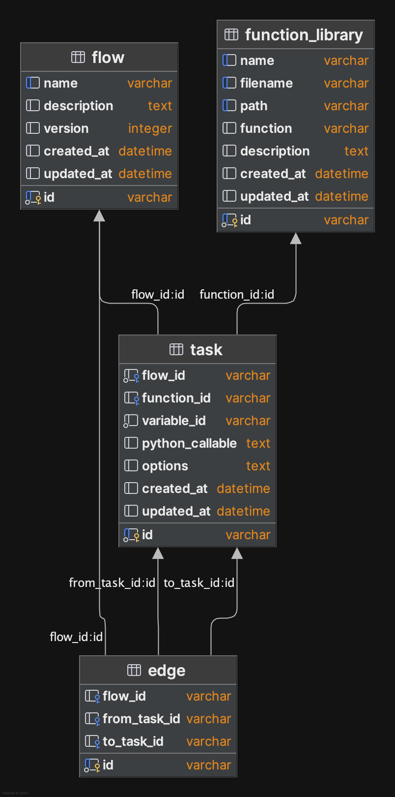

# Workflow 데이터베이스 설계서

## 1. 개요

본 문서는 Workflow 시스템의 데이터 테이블 스키마를 정의한다.

## 2. ERD (Entity-Relationship Diagram)

## 3. 테이블 정의

### 3.1. Flow 테이블

| 필드명           | 타입            | 설명                                               |
|---------------|---------------|--------------------------------------------------|
| `id`          | `String` (PK) | Flow(DAG) 고유 ID format: `dag_<name hashing>` |
| `name`        | `String`      | Flow 의 이름                                        |
| `description` | `Text`        | Flow 설명                                          |
| `version`     | `Integer`     | Flow 버전 (기본값: 1)                                 |
| `created_at`  | `DateTime`    | 생성 시각 (자동 기록)                                    |
| `updated_at`  | `DateTime`    | 수정 시각 (자동 갱신)                                    |

#### 연관 관계

- `Task`: Flow 에 정의된 Task 목록 (Flow:Task = 1:N)
- `Edge`: Flow 내 Task 간 연결 관계 (Flow:Edge = 1:N)

### 3.2. Task 테이블

| 필드명               | 타입            | 설명                       |
|-------------------|---------------|--------------------------|
| `id`              | `String` (PK) | Task 의 고유 ID             |
| `flow_id`         | `String` (FK) | Flow ID                  |
| `function_id`     | `String` (FK) | 실행할 함수 ID                |
| `variable_id`     | `String`      | DAG 정의시 task 변수 이름       |
| `python_callable` | `Text`        | Airflow DAG 에서 실행할 코드    |
| `options`         | `Text`        | Airflow DAG 에서 task 의 옵션 |
| `created_at`      | `DateTime`    | 생성 시각 (자동 기록)            |
| `updated_at`      | `DateTime`    | 수정 시각 (자동 갱신)            |

#### 연관 관계

- `function_id`: Task 가 실행할 함수 연결 (Task:FunctionLibrary = N:1)

### 3.3. Edge 테이블

| 필드명            | 타입            | 설명           |
|----------------|---------------|--------------|
| `id`           | `String` (PK) | Edge 의 고유 ID |
| `flow_id`      | `String` (FK) | Flow ID      |
| `from_task_id` | `String` (FK) | 출발 Task      |
| `to_task_id`   | `String` (FK) | 도착 Task      |

### 3.4. FunctionLibrary 테이블

| 필드명           | 타입            | 설명             |
|---------------|---------------|----------------|
| `id`          | `String` (PK) | UDF 고유 ID      |
| `name`        | `String`      | UDF 이름         |
| `filename`    | `String`      | UDF 가 정의 파일 이름 |
| `path`        | `String`      | UDF 파일 저장 경로   |
| `function`    | `String`      | 함수명            |
| `description` | `Text`        | UDF 설명         |
| `created_at`  | `DateTime`    | 생성 시각 (자동 기록)  |
| `updated_at`  | `DateTime`    | 수정 시각 (자동 갱신)  |

## 4. 데이터 흐름

### 4.1. UDF 생성

1. 사용자가 UDF 를 등록
2. FunctionLibrary 에 메타데이터 저장 + UDF 파일 Filesystem 에 저장

### 4.2. Flow 생성

1. 사용자가 Flow 설정
2. Flow 메타데이터 저장 + DAG 파일 생성 후 Filesystem 에 저장
3. Airflow Scheduler 가 DAG 확인 및 로딩
4. Airflow 에서 사용 가능 하면 사용자에게 Flow 생성 완료

### 4.3. Flow 실행

1. 사용자가 Flow 실행 요청 or 스케줄러에 설정된 시간에 실행
2. Airflow 에서 DAG 실행 및 결과 저장

## 5. 추가 고려 사항

- 각 Task 의 입력, 출력 값 설정방법
- 각 Task 의 동작 방식 (Python, Docker)
